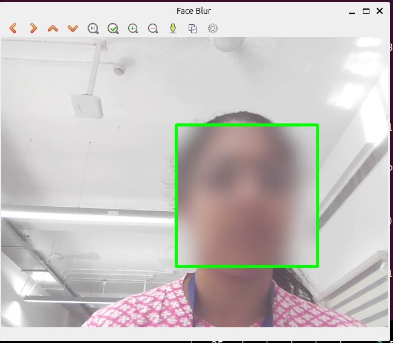

# 1. Real-Time Face Detection using MediaPipe & OpenCV 

A simple and efficient real-time face detection system built using MediaPipe and OpenCV.
This project detects faces from a live webcam feed and displays bounding boxes with confidence scores and FPS

Technologies Used: 
---
     Python 3

     OpenCV

     MediaPipe

     NumPy


Face Detection Initialization:
---
     mpFaceDetection = mp.solutions.face_detection
     faceDetection = mpFaceDetection.FaceDetection()


How It Works:
---
   Webcam captures real-time video.

   Frames are converted from BGR to RGB (required by MediaPipe).

   MediaPipe Face Detection model processes the image.

 For each detected face:

     Bounding box is calculated

     Confidence score is displayed

     FPS is calculated and shown on screen.

Install dependencies:
 ---            
      pip install opencv-python mediapipe numpy

---

# 2. Real Time face blur using opencv:

    This project detects human faces in real-time using OpenCV’s Haar Cascade classifier and applies a Gaussian blur effect to anonymize them.

   It captures video from the webcam, detects faces frame-by-frame, and blurs only the detected face regions while keeping the rest of the frame unchanged.

   
Technologies used:

        Python 3

        OpenCV

        Haar Cascade Classifier (haarcascade_frontalface_default.xml)

How it works:


Capture webcam video using cv2.VideoCapture()

Convert frame to grayscale

Detect faces using detectMultiScale()

Extract Region of Interest (ROI)

Apply cv2.GaussianBlur() to the face

Replace blurred ROI back into original frame

Display processed frame

Output:




# 3. Real time face detection using Opencv's Haarcascade

   This project implements a real-time face detection system using OpenCV’s pre-trained Haar Cascade classifier. The system captures live video from the webcam, detects human faces in each frame, and draws bounding boxes around them.


Technologies used:

      Python
      OpenCV
      Haar Cascade Classifier

How it works:

   i.Load Haar Cascade Classifier
     The program loads OpenCV’s pre-trained haarcascade_frontalface_default.xml model for detecting frontal faces.

   ii.Initialize Webcam
      The webcam is accessed using cv2.VideoCapture() to capture live video frames.

   iii.Frame Processing
       Each frame is converted to grayscale.

   iv.The Haar Cascade classifier detects faces in the grayscale image.
       For every detected face, a blue rectangle is drawn around it.


# 4.Real-Time Pencil Sketch Using OpenCV

This project converts live webcam video into a real-time pencil sketch effect using OpenCV.


It displays:
   Original camera feed

   Pencil sketch version

   Both shown side-by-side in one window

Technologies used:
       
     Python3
     OpenCV
     NumPy

How it works:

  Convert frame to grayscale

  Invert grayscale image

  Apply Gaussian Blur

  Blend using Dodge technique


Output


# 5. Real time facial landmark detection using dlib and opencv

    A real-time Facial Landmark Detection system built using Dlib and OpenCV.
   This project detects faces from webcam input and plots 68 facial landmark points (eyes, nose, mouth, jawline, etc.) on the    detected face.

Features:

   Real-time webcam face detection

   68 facial landmark detection

   Landmark visualization with OpenCV

   Fast and lightweight implementation

   Clean and simple code structure

Technologies used:
      
      Python 3.x
      OpenCV
      Dlib
      NumPy

Model Used:
    This project uses:

     Dlib's Frontal Face Detector
     shape_predictor_68_face_landmarks.dat model (pre-trained)

Install dependencies:
      
       pip install opencv-python
       pip install dlib
       pip install numpy

Output:

 


 # 6. Real-Time Head Pose Estimation using OpenCV & dlib

## Overview

This project implements **real-time head pose estimation** using a webcam.
It detects a face, extracts facial landmarks, and estimates the head orientation (pose) using the **solvePnP** algorithm from OpenCV.

The output is visualized as a **line projecting from the nose**, indicating the head direction.

---

## Features

   Real-time webcam head pose estimation
   
   Facial landmark detection using dlib (68-point model)
   
   Pose estimation using OpenCV `solvePnP`
   
   Visualization of head direction with nose projection
   
   Works for single or multiple faces

---

## Working Pipeline

```
Webcam Frame
     ↓
Face Detection (dlib HOG detector)
     ↓
Facial Landmark Detection (68 points)
     ↓
Select key landmarks (nose, chin, eyes, mouth)
     ↓
solvePnP → Rotation & Translation vectors
     ↓
projectPoints → Nose direction
     ↓
Display head pose visualization
```

---

## Requirements

Install dependencies:

```bash
pip install opencv-python dlib numpy
```

Download the pretrained landmark model:
   **shape_predictor_68_face_landmarks.dat**

Place it in the project folder.

---


##  Key Concepts Used

### 🔹 Facial Landmark Detection

dlib detects 68 facial keypoints.
This project uses:

* Nose tip → 30
* Chin → 8
* Left eye corner → 36
* Right eye corner → 45
* Left mouth → 48
* Right mouth → 54

---

### 🔹 3D Model Points

Predefined approximate 3D face model used for pose estimation.

---

### 🔹 solvePnP

Computes:

* Rotation vector → Head orientation
* Translation vector → Face position

---

### 🔹 projectPoints

Projects a 3D point onto the image plane to draw a direction line from the nose.

---

## Output


